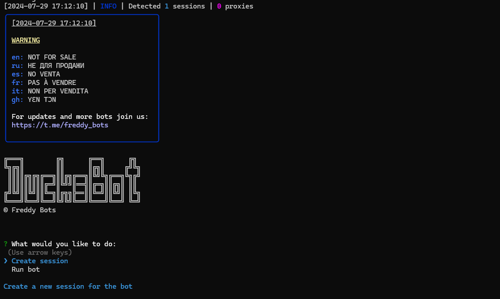

# DucksBot 🦆

[](https://t.me/likhondotxyz)
[](https://github.com/likhositories/duckscoop-bot/stargazers)
[](https://github.com/likhositories/duckscoop-bot/blob/main/LICENSE)



> **Note:** Use Node.js 18 or greater

## 🚀 Quick Start

<p align="center">
  <a href="https://t.me/duckscoop_bot/app?startapp=WGBHHpDlNK">
    
  </a>
</p>

## ✨ Functionality

| Feature                                                       | Supported |
| ------------------------------------------------------------- | :-------: |
| Claiming daily checkin                                        |    ✅     |
| Completing missions                                           |    ✅     |
| Multithreading                                                |    ✅     |
| Binding a proxy to a session                                  |    ✅     |
| Auto-purchase of items if you have coins (multitap, attempts) |    ✅     |
| Random sleep time between clicks                              |    ✅     |

## ⚙️ Settings

| Setting                    | Description                                                               |
| -------------------------- | ------------------------------------------------------------------------- |
| **API_ID / API_HASH**      | Platform data from which to launch a Telegram session (stock - Android)   |
| **AUTO_COMPLETE_MISSIONS** | Whether the bot should complete the missions (True / False)               |
| **AUTO_CLAIM_CHECKIN**     | Whether the bot should claim the daily checkin (True / False)             |
| **USE_PROXY_FROM_FILE**    | Whether to use proxy from the `bot/config/proxies.js` file (True / False) |

## 🛠 Installation

1. Clone the repository:
   ```shell
   git clone https://github.com/likhositories/duckscoop-bot.git
   cd duckscoop-bot
   ```

2. Install dependencies:
   
   <details>
   <summary>Linux and macOS</summary>

   ```shell
   chmod +x check_node.sh
   ./check_node.sh
   ```
   OR
   ```shell
   npm install
   cp .env-example .env
   nano .env  # Specify your API_ID and API_HASH, the rest is taken by default
   ```
   </details>

   <details>
   <summary>Windows</summary>

   - Double click on `INSTALL.bat` in the duckscoop-bot directory to install the dependencies
   - Double click on `START.bat` in the duckscoop-bot directory to start the bot
   
   OR
   ```shell
   npm install
   copy .env-example .env
   # Edit .env file and specify your API_ID and API_HASH
   ```
   </details>

3. Run the bot:
   ```shell
   node index.js
   ```

### Quick Launch Arguments

You can use arguments for quick launch:

```shell
node index.js --action=1  # Create session
node index.js --action=2  # Run clicker
```

## 📄 License

<p align="center">
  <a href="https://github.com/likhositories/duckscoop-bot/blob/main/LICENSE">
    
  </a>
</p>

This project is licensed under the MIT License - see the [LICENSE](LICENSE) file for details.

## 🤝 Contributing

<p align="center">
  <a href="https://github.com/likhositories/duckscoop-bot/issues">
    
  </a>
</p>

Contributions, issues, and feature requests are welcome! Feel free to check our [issues page](https://github.com/likhositories/duckscoop-bot/issues).

## 📬 Contact

<p align="center">
  <a href="https://t.me/likhondotxyz">
    
  </a>
</p>

For support or queries, reach out on Telegram: [@likhondotxyz](https://t.me/likhondotxyz)

---

<p align="center">
  <a href="https://github.com/likhositories/duckscoop-bot">
    
  </a>
</p>
